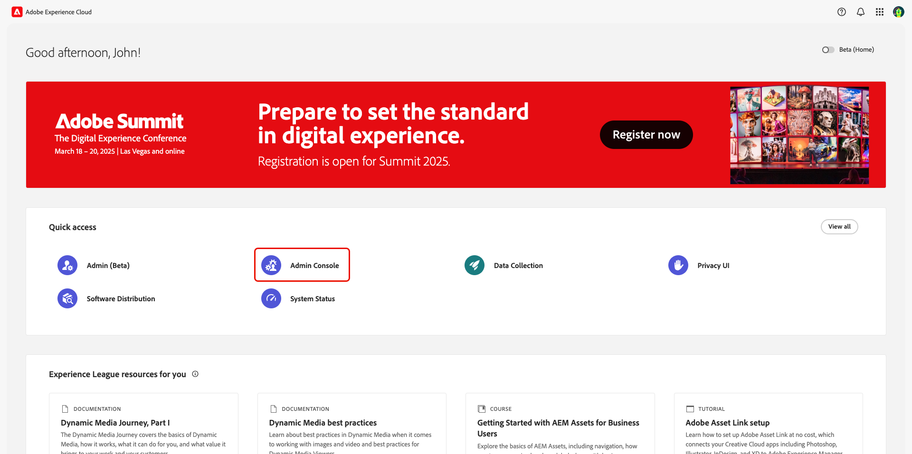
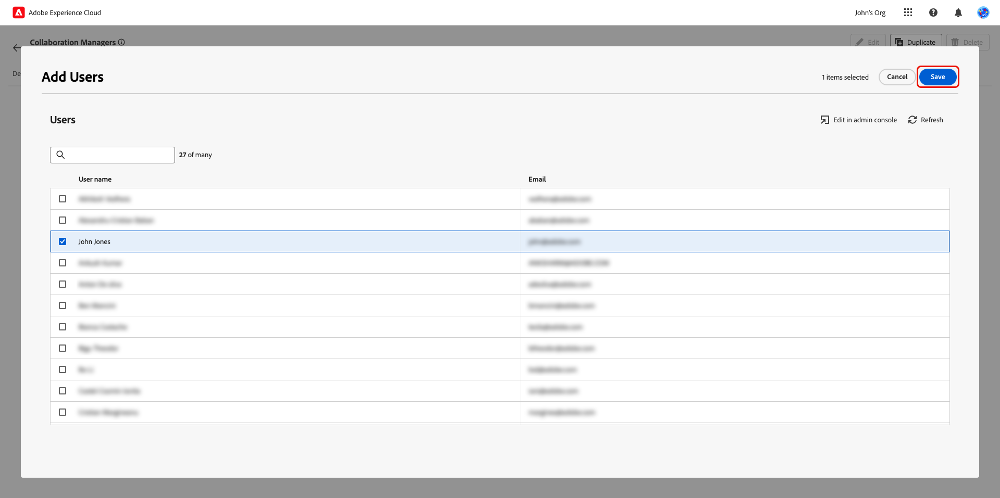
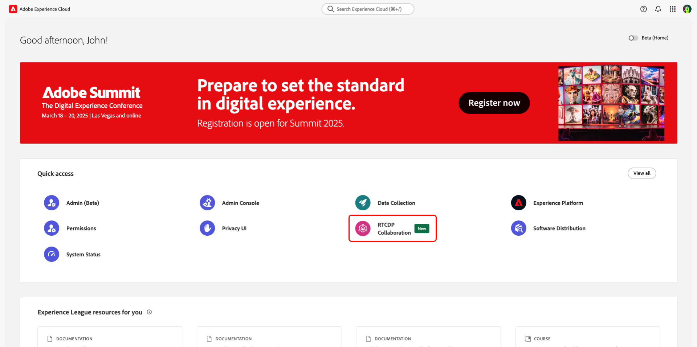

# Gebruikerstoegang beheren via Rechten {#manage-user-access}

{{limited-availability-release-note}}

Beheer toestemmingen en gebruikerstoegang tot individuele componenten binnen Real-Time CDP Collaboration door de interface van de Toestemmingen van Experience Cloud . De toestemmingen staan systeem en productbeheerders toe om [ rollen ](./manage-roles.md) te bepalen om gebruikerstoegang tot specifieke eigenschappen en middelen te beheren.

## Toegang tot machtigingen configureren {#permissions-access}

Om tot Toestemmingen toegang te hebben, moet u zowel productbeheerder als gebruikerstoegang tot het product van Adobe Experience Platform hebben. Een systeembeheerder wordt vereist om de voorrechten van de productbeheerder te vormen, terwijl de gebruikersvoorrechten door een systeem of productbeheerder kunnen worden gevormd. Voor meer informatie over de administratieve rollen, lees de [ gids van de toegangsbeheerderhiërarchie ](./overview.md#hierarchy).

>[!TIP]
>
>Door deze gids, zal een **beheerder** naar **zowel systeem als productbeheerders** verwijzen.

### Systeembeheerders: configureren van toegang tot productbeheerder {#admin-access}

Geef een beheerder van een gebruikersproduct via de volgende stappen toegang om deze beheermogelijkheden te bieden binnen het Experience Platform-product:

>[!IMPORTANT]
>
>Als systeembeheerder, hebt u uit-van-de doostoegang tot specifieke producten van Experience Cloud, zoals Adobe Admin Console. Als u echter Machtigingen wilt gebruiken, moet u uzelf productbeheerder en gebruiker toegang geven tot het Experience Platform-product. Volg de hieronder stap voor stap gids om u toegang als systeembeheerder te geven.

Login aan [ Adobe Experience Cloud ](https://experience.adobe.com/) met uw geloofsbrieven. De weergave Home wordt weergegeven met een lijst van uw beschikbare producten in de sectie **[!UICONTROL Quick access]** . Selecteer **[!UICONTROL Admin Console]**.

De [ vertoningen van het de overzichtdashboard van Adobe Admin Console ](https://adminconsole.adobe.com/). Selecteer **[!UICONTROL Adobe Experience Platform]** in de lijst **[!UICONTROL Products]** onder **[!UICONTROL Products and services]** .

Het Adobe Experience Platform-dashboard wordt weergegeven. Selecteer de tab **[!UICONTROL Admins]** en selecteer vervolgens **[!UICONTROL Add admin]** .

Het dialoogvenster **[!UICONTROL Add product administrators]** wordt weergegeven. Voer de e-mail of gebruikersnaam van de gebruiker in het tekstveld **[!UICONTROL Email or username]** in en selecteer vervolgens het juiste account in het vervolgkeuzemenu. Selecteer **[!UICONTROL Save]** om de gebruiker als productbeheerder toe te voegen.

De gebruiker beschikt nu over productbeheerdersrechten en kan beheerfuncties, zoals het toevoegen van gebruikers of andere beheerders, uitvoeren op het product in de Admin Console. Vervolgens hebben ze gebruikerstoegang tot het Experience Platform-product nodig om functies binnen Machtigingen te kunnen openen en uitvoeren.

### Beheerders: gebruikerstoegang tot Experience Platform configureren {#user-access}

Nu u de beheerderstoegang van het gebruikersproduct hebt verleend, moet u hen gebruikerstoegang tot het product van Experience Platform verlenen. Als deel van de toegangsconfiguraties, zult u de gebruiker specifieke [ productprofielen ](https://helpx.adobe.com/enterprise/using/manage-product-profiles.html) toewijzen.

>[!TIP]
>
>Als je de vorige sectie volgt, ben je al in het Adobe Experience Platform-product en kun je de eerste stap overslaan.

Navigeer aan [ Admin Console ](https://adminconsole.adobe.com/) en selecteer **[!UICONTROL Adobe Experience Platform]** van de **[!UICONTROL Products]** lijst onder **[!UICONTROL Products and services]**.

Selecteer de tab **[!UICONTROL Users]** en selecteer vervolgens **[!UICONTROL Add users]** .

Het dialoogvenster **[!UICONTROL Add users to this product]** wordt weergegeven. Voer de naam of het e-mailbericht van de gebruiker in het tekstveld **[!UICONTROL Name, user group or email address]** in en selecteer vervolgens het juiste account in het vervolgkeuzemenu. Selecteer vervolgens de optie **[!UICONTROL Products]** Toevoegen.

Het dialoogvenster **[!UICONTROL Select product profiles]** wordt weergegeven. Selecteer **[!UICONTROL AEP-Default-All-Users]** en **[!UICONTROL Default Production All Access]** en selecteer vervolgens **[!UICONTROL Apply]** .

Bevestig dat de gegevens juist zijn en selecteer vervolgens **[!UICONTROL Save]** .

De gebruiker zou productbeheerder en producttoegang tot Experience Platform moeten hebben, die hen toegang tot Toestemmingen krijgt. Daarna, moet u de gebruiker twee fundamentele rollen toewijzen om hen toegang tot het Platform UI van de Ervaring te geven.

### Beheerders: Experience Platform UI-toegang configureren {#product-access}

In Real-Time CDP Collaboration werken beheerders en eindgebruikers samen met gegevens uit Experience Platform, zoals publiek- en auditlogboeken. Deze gegevens worden bewaard binnen instanties van Experience Platform die sandboxen worden genoemd. Om ervoor te zorgen dat de gebruikers met deze gegevens kunnen in wisselwerking staan, moet u [ standaardrollen ](https://experienceleague.adobe.com/en/docs/experience-platform/access-control/home#default-roles) aan de gebruiker toewijzen.

Om te beginnen, navigeer aan [ Adobe Experience Cloud ](https://experience.adobe.com/). U moet nu **[!UICONTROL Experience Platform]** en **[!UICONTROL Permissions]** inside of **[!UICONTROL Quick access]** zien.

>[!NOTE]
>
> De producten kunnen enige minuten duren om toegang te krijgen tot en u ontvangt een e-mail met de waarschuwing dat u toegang hebt gekregen. Als u Experience Platform of Machtigingen niet ziet in Adobe Experience Cloud nadat u het e-mailbericht hebt ontvangen, meldt u zich af en vervolgens weer aan bij uw account.

In dit stadium kunt u nu toegang krijgen tot **[!UICONTROL Permissions]** . Als u toegang probeert te krijgen tot **[!UICONTROL Experience Platform]** , wordt een waarschuwing weergegeven dat er geen sandboxen zijn ingeschakeld, zoals hieronder wordt weergegeven. Om dit op te lossen, moet u de standaardrollen aan uw gebruiker toewijzen. Selecteer eerst **[!UICONTROL Permissions]** .

Het dashboard **[!UICONTROL Permissions]** wordt weergegeven. Selecteer **Gebruikers** van het linkerpaneel en selecteer dan de naam van de gebruiker.

Selecteer de tab **[!UICONTROL Roles]** en selecteer vervolgens **[!UICONTROL Add roles]** .

Het dialoogvenster **[!UICONTROL Add Roles]** wordt weergegeven. Selecteer **[!UICONTROL Default Production All Access]** en **[!UICONTROL Sandbox Administrators]** en selecteer vervolgens **[!UICONTROL Save]** .

U hebt nu toegang tot Experience Platform en machtigingen. In de laatste stap geeft u Real-Time CDP Collaboration toegang.

### Beheerders: Real-Time CDP Collaboration-toegang configureren {#RTCDP-collaboration-access}

Om gebruikers toegang tot Real-Time CDP Collaboration te verlenen, zult u een toegangsbeheerconcept genoemd rollen gebruiken. De rollen bepalen het niveau van toegang een beheerder of een gebruiker moet [ middelen ](https://experienceleague.adobe.com/en/docs/experience-platform/access-control/home#permissions) in uw organisatie.

Wanneer het vormen van individuele toegang tot Real-Time CDP Collaboration, zult u gebruikersrollen toewijzen die toestemmingen van het middel van Samenwerking bevatten. U kunt [ gebruiken beheert rollen ](./manage-roles.md) gids om informatie over te vinden:

- de [ twee standaardrollen ](./manage-roles.md#standard-roles) en de niveaus van toegang die zij aan Real-Time CDP Collaboration verlenen
- het creëren van [ douanerollen ](./manage-roles.md#specific-access-roles) gebruikend het middel van Collaboration
- de lijst van toestemmingen inbegrepen in het middel van Samenwerking

>[!NOTE]
>
>Bovendien moet een gebruiker worden toegewezen aan een rol die de machtiging **[!UICONTROL Prod]** bevat in de **[!UICONTROL Sandboxes]** -bronnen. Beide standaardrollen bevatten deze toestemming. Als u verkiest om een gebruiker een douanerol in plaats van een standaardrol toe te wijzen, moet u één van de rollen verzekeren zij worden toegewezen om deze toestemming te bevatten.

Zodra u hebt gekozen of een rol gecreeerd die het niveau van toegang uw gebruikersbehoeften omvat, moet u de gebruiker aan die rol toewijzen.

#### Rollen toewijzen

U kunt meerdere rollen toewijzen aan één gebruiker of meerdere gebruikers toewijzen aan één rol. Het eerste geval werd behandeld vroeger toen [ het toewijzen van de standaardrollen ](#product-access) om een gebruikerstoegang tot Experience Platform te geven. In de volgende stappen wijst u gebruikers rechtstreeks toe aan de rol die u hebt geselecteerd.

Selecteer in **[!UICONTROL Permissions]** **[!UICONTROL Roles]** in het linkerdeelvenster en selecteer vervolgens uw rol in de lijst.

De detailpagina van de rol wordt weergegeven. Selecteer de tab **[!UICONTROL Users]** en selecteer vervolgens **[!UICONTROL Add Users]** .

Het dialoogvenster **[!UICONTROL Add Users]** wordt weergegeven. Selecteer de gebruiker(s) in de lijst en selecteer vervolgens **[!UICONTROL Save]** .

De gebruiker moet **[!UICONTROL RTCDP Collaboration]** nu zien als een product onder **[!UICONTROL Quick Access]** in Experience Cloud.

## Volgende stappen

Nu gebruikers toegang hebben tot Real-Time CDP Collaboration, kunnen ze het product gaan gebruiken. Meer over het product als geheel leren, lees de [ overzichtsgids ](../home.md).
