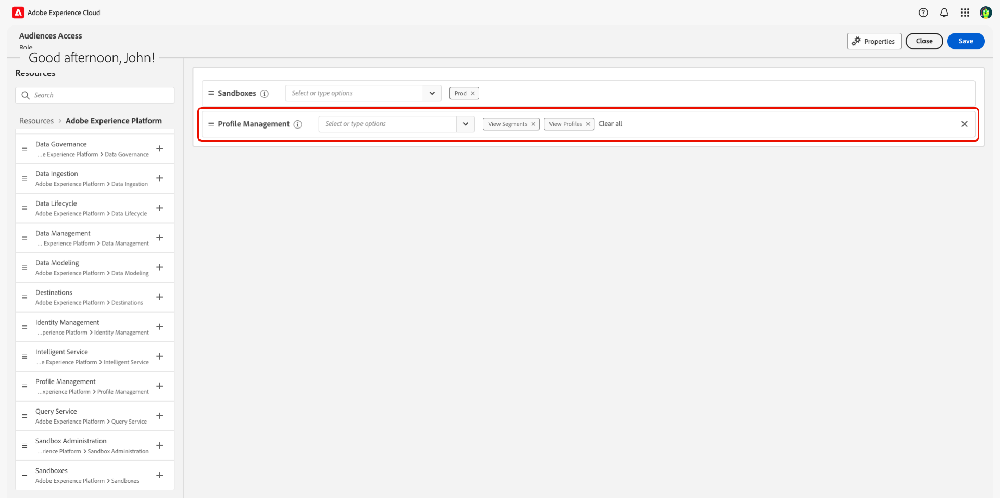

# Overzicht van toegangsbeheer

{{limited-availability-release-note}}

>[!IMPORTANT]
>
> Als u een eindgebruiker toegang tot Adobe Real-Time CDP Collaboration wilt hebben, neemt u contact op met uw systeem of productbeheerder om bestaande toegang te controleren. Neem contact op met uw Adobe-vertegenwoordiger als u niet weet wie uw systeembeheerder is.

De controle van de toegang voor Adobe Real-Time CDP Collaboration wordt verstrekt door Admin Console en Toestemmingen in [&#x200B; Adobe Experience Cloud &#x200B;](https://experience.adobe.com/){target="_blank"}. In deze gids, zult u leren hoe te om toegang tot zich of andere leden van uw team, afhankelijk van uw gebruiksgeval te verlenen.

## Toegangsbeheerhiërarchie {#hierarchy}

Om toegangsbeheer aan Collaboration te vormen, moet u **&#x200B;**&#x200B;systeem of productbeheerdervoorrechten hebben. Een systeembeheerder heeft geen beperkingen en is provisioned tijdens het aan boord gaan proces. Ondertussen, kan een productbeheerder administratieve functies voor alle producten verstrekken zij zijn toegewezen aan. Een productbeheerder moet product en administratieve toegang door een systeembeheerder worden verleend.

In deze handleidingen wordt beschreven hoe u toegang configureert voor systeembeheerders, productbeheerders en eindgebruikers. Verwijs naar de lijst hieronder om het belangrijkste verschil tussen de rollen te begrijpen.

| Rol | Beschrijving |
| --- | --- |
| Systeembeheerder | De supergebruiker voor de organisatie. Zij kunnen alle administratieve taken in Admin Console uitvoeren en toestemmingen hebben om administratieve functies aan andere gebruikers te delegeren. |
| Productbeheerder | Hiermee beheert u de aan hen toegewezen producten en alle bijbehorende beheerfuncties, zoals gebruikers toevoegen aan organisaties, gebruikers toevoegen aan of verwijderen uit productprofielen en andere productbeheerders toevoegen aan of verwijderen uit een product. |
| Eindgebruiker | De gebruikers in uw organisatie die de producten gebruiken. |

{style="table-layout:auto"}

Voor meer informatie over administratieve rollen, bezoek het [&#x200B; Centrum van de Hulp van Adobe &#x200B;](https://helpx.adobe.com/enterprise/using/admin-roles.html).

>[!TIP]
>
>Het gebruik van **beheerders** in deze gidsen zal naar **zowel systeem als productbeheerders** verwijzen.

## Aanvullende producten {#products}

Alvorens u toegang tot Collaboration kunt geven, zult u toegang tot veelvoudige producten, afhankelijk van uw [&#x200B; gebruiksgeval &#x200B;](#use-cases) nodig hebben. De toegangsbeheergidsen kunnen door veelvoudige gebruikersinterfaces werken aangezien u vordert, elk dienend een specifiek doel binnen het proces van de toegangsconfiguratie. Raadpleeg de onderstaande tabel voor een beter begrip van de vraag waarvoor elk product wordt gebruikt.

| Product | Gebruiksmiddelen |
| --- | --- |
| [&#x200B; Admin Console &#x200B;](https://adminconsole.adobe.com/) | Beheerders gebruiken dit om gebruikerproducten en/of beheerdersrechten toe te wijzen. |
| [&#x200B; Toestemmingen &#x200B;](https://experience.adobe.com/) | Beheerders gebruiken dit om beheerders of eindgebruikers rollen toe te wijzen. |
| [Experience Platform](https://platform.adobe.com/) | Beheerders en eindgebruikers moeten toegang krijgen tot het Experience Platform-product om hen aan rollen toe te wijzen. |

## Waar begint {#use-cases}

Nu u een dieper inzicht hebt in de gebruikers- en administratieve functies en de verschillende Experience Cloud-producten, kunt u beginnen met het geven van toegang tot Collaboration. Er zijn twee belangrijke factoren die de stappen beïnvloeden u zult moeten nemen:

- als u beheerder of eindgebruikertoegang toewijst
- als de gebruikers al toegang hebben tot het Experience Platform-product

Verwijs naar de grafiek hieronder om te bepalen wie nodig is om de voorrechten te vormen en waar te beginnen gebaseerd op uw gebruikscase van het toegangsbeheer. **ben zeker om het leerprogramma door aan het eind van de gids van uw beginnende plaats te volgen.**

>[!TIP]
>
> Een supergebruiker verwijst naar het hoogste niveau van toegang dat door de systeembeheerder moet worden verworven. Een supergebruiker kan alle beheertaken en gebruikersfunctionaliteit uitvoeren. Een systeembeheerder heeft productfunctionaliteit uit-van-de-doos niet en moet zich de aangewezen toegang, zoals aangetoond in de grafiek hieronder geven.

| Gebruiksscenario | Vereiste rol | Waar begint |
| --- | --- | --- |
| Super-gebruiker zonder bestaande Experience Platform-producttoegang. | Een systeembeheerder. | [&#x200B; vorm de toegang van de productbeheerder &#x200B;](./manage-user-access.md#admin-access) |
| Super gebruiker voor een bestaande het systeembeheerder van Experience Platform **met** toegang UI van Experience Platform. | Een systeembeheerder. | [&#x200B; vorm Collaboration toegang &#x200B;](./manage-user-access.md#RTCDP-collab-access) |
| Super gebruiker voor een bestaande het systeembeheerder van Experience Platform **zonder** toegang van Experience Platform UI. | Een systeembeheerder. | [&#x200B; vorm de toegang van de productbeheerder &#x200B;](./manage-user-access.md#admin-access) |
| Rechten van productbeheerders en Collaboration-toegang voor een nieuwe productbeheerder. | Een systeembeheerder. | [&#x200B; vorm de toegang van de productbeheerder &#x200B;](./manage-user-access.md#admin-access) |
| De toegang van Collaboration voor een bestaande het productbeheerder van Experience Platform **met** toegang van Experience Platform UI. | Een systeem- of productbeheerder. | [&#x200B; vorm Collaboration toegang &#x200B;](./manage-user-access.md#RTCDP-collab-access) |
| De toegang van Collaboration voor een bestaande het productbeheerder van Experience Platform **zonder** toegang van Experience Platform UI. | Een systeem- of productbeheerder. | [&#x200B; vorm gebruikerstoegang &#x200B;](./manage-user-access.md#user-access) |
| Collaboration-toegang voor nieuwe eindgebruikers. | Een systeem- of productbeheerder. | [&#x200B; vorm gebruikerstoegang &#x200B;](./manage-user-access.md#user-access) |
| Collaboration-toegang voor een bestaande gebruiker met Experience Platform-toegang. | Een systeem- of productbeheerder. | [&#x200B; vorm Collaboration toegang &#x200B;](./manage-user-access.md#RTCDP-collab-access) |

{style="table-layout:auto"}

## Aanvullende machtigingen

Als u eenmaal toegang hebt gekregen tot Collaboration, hebt u mogelijk nog enkele Experience Platform-machtigingen nodig voor specifieke functies.

### Bronnen voor publiek {#audience-sourcing}

Voordat u een publiek naar medewerkers kunt sturen, moet u eerst een publiek naar Collaboration sturen. Experience Platform is momenteel de enige gegevensverbinding met zelfbediening die wordt ondersteund voor het importeren van soorten publiek. Om te beginnen moet aan de gebruiker(s) die het publiek aan boord nemen beheert (beheren) een rol worden toegewezen die de volgende **[!UICONTROL Profile Management]** bronmachtigingen bevat:

| Machtiging | Beschrijving |
| ---- | ---- |
| [!UICONTROL View Segments] | Hiermee kan de gebruiker de lijst met beschikbare soorten publiek in een sandbox weergeven. |
| [!UICONTROL View Profiles] | Hiermee kan de gebruiker de velden zien die beschikbaar zijn voor toewijzing aan samenwerkingsvelden. |

Hieronder ziet u een voorbeeldrol met de bovenstaande machtigingen toegevoegd. Voor meer informatie bij het creëren van of het toewijzen van rollen, verwijs naar [&#x200B; rollen &#x200B;](./manage-roles.md) gids beheren.

>[!NOTE]
>
>Gebruikers kunnen in Collaboration met een publiek werken nadat ze zonder de bovenstaande machtigingen zijn gedownload.

## Volgende stappen

Zodra u hebt bepaald waar te beginnen, volg de verbinding van uw gebruiksgeval beginnen toegang te vormen. Als u over het vormen van toegang tot Collaboration als beheerder voorbij die gebruiksgevallen wilt leren, verwijs naar [&#x200B; gebruikerstoegang &#x200B;](manage-user-access.md) gids beheren. Om over rollen en hun deel te leren in het vormen van toegang tot diverse componenten van Collaboration, verwijs naar [&#x200B; rollen &#x200B;](manage-roles.md) gids beheren.
