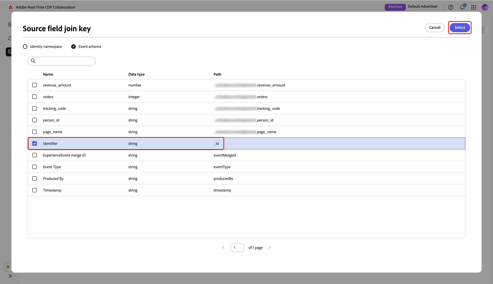
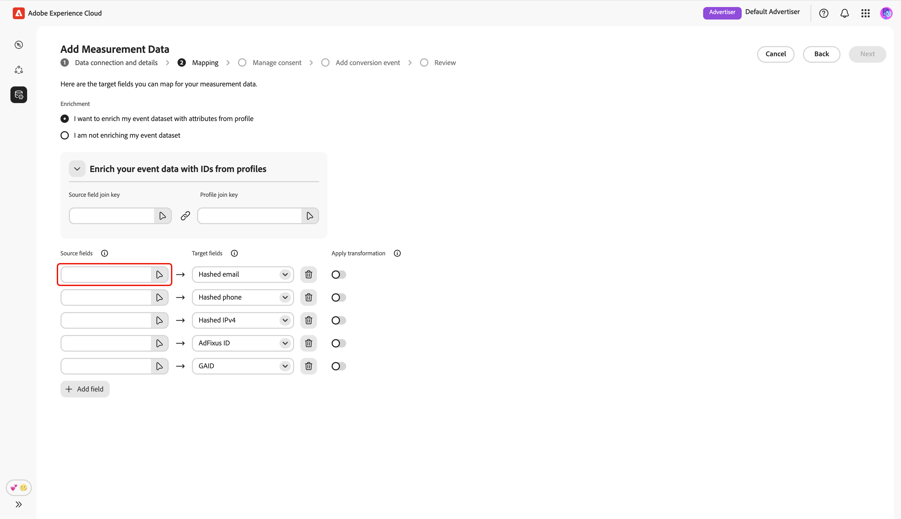
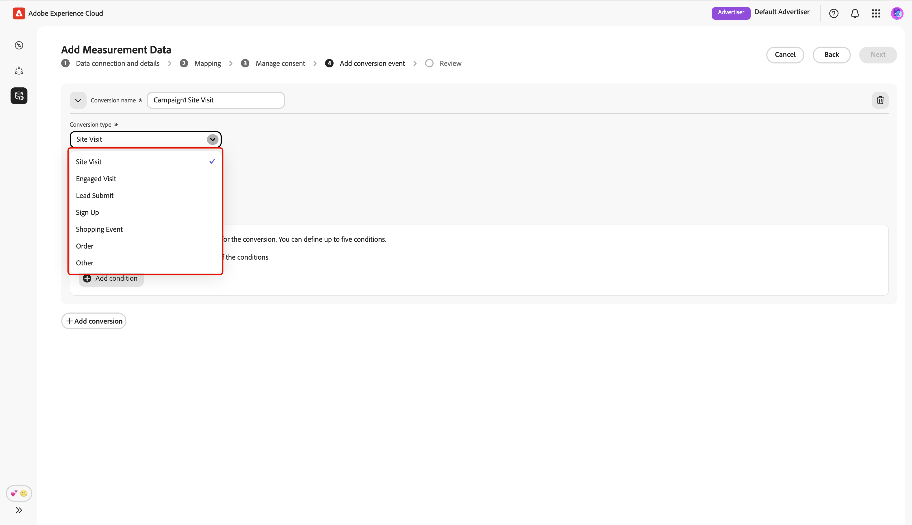
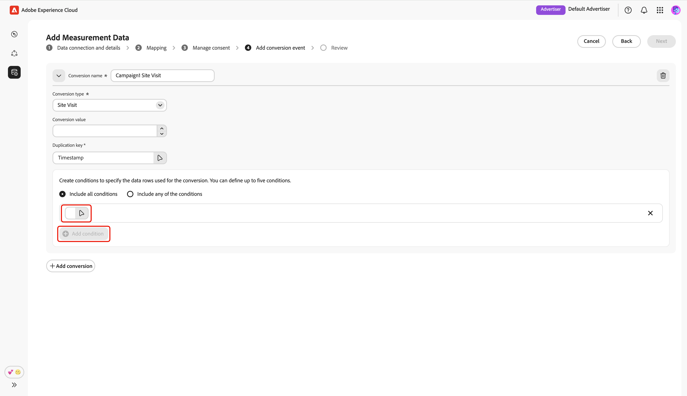
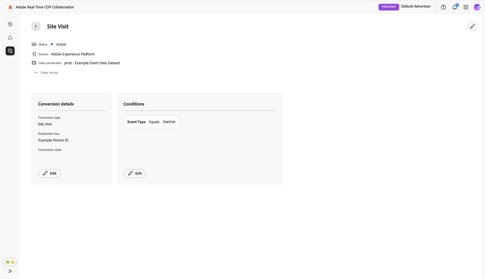

# Metingsgegevens toevoegen en beheren {#add-and-manage-measurement-data}

>[!CONTEXTUALHELP]
>id="rtcdp_collaboration_onboard_measurement_data"
>title="Meer informatie"
>abstract=""

>[!CONTEXTUALHELP]
>id="rtcdp_collaboration_measurement_data_target_fields"
>title="Doelvelden"
>abstract="Tijdelijke aanduiding voor meetdoelvelden."

>[!CONTEXTUALHELP]
>id="rtcdp_collaboration_measurement_data_source_fields"
>title="Source-velden"
>abstract="Plaatsaanduiding voor bronvelden voor metingen."

>[!CONTEXTUALHELP]
>id="rtcdp_collaboration_import_measurement_mapping_source_fields"
>title="Bronvelden toewijzen"
>abstract="Plaatsaanduiding voor meettoewijzing van bronvelden."

>[!CONTEXTUALHELP]
>id="rtcdp_collaboration_import_measurement_mapping_target_fields"
>title="Doelvelden toewijzen"
>abstract="Plaatsaanduiding voor meettoewijzing van doelvelden."

{{limited-availability-release-note}}

In dit document worden de stappen beschreven die moeten worden uitgevoerd om gegevens voor campagnemetingen toe te voegen aan Adobe Real-Time CDP Collaboration. Uitgevers kunnen met Adobe-teams samenwerken om gegevens voor de meting van campagnes te uploaden. Nadat dat gegeven wordt geupload en verwerkt, zowel zullen de uitgever als de adverteerder uitgebreide [&#x200B; rapporten van de campagnemeting &#x200B;](/help/guide/collaborate/measure.md) kunnen bekijken.

## Metingsgegevens toevoegen {#add-measurement-data}

Als adverteerder kunt u uw meetgegevens met conversiegebeurtenissen uploaden naar Collaboration voor gebruik in campagnemaatmetingsrapporten. Conversiegegevens omvatten doorgaans velden zoals gebruikers-id&#39;s (bijvoorbeeld gehashte e-mail- of apparaat-id&#39;s), tijdstempel van de conversiegebeurtenis en specifieke details van conversiegebeurtenissen zoals aankoop of aanmelding.

Navigeer naar het tabblad **[!UICONTROL My measurement data]** in de **[!UICONTROL Setup]** -werkruimte om meetgegevens te verzamelen. Selecteer het add pictogram () en selecteer vervolgens **[!UICONTROL Measurement data]** .

Als dit de eerste meetgegevens zijn, kunt u ook de optie **[!UICONTROL Add]** selecteren.

{zoomable="yes"}

Het scherm **[!UICONTROL Add measurement data]** wordt weergegeven met een overzicht van de stappen voor het verzamelen van meetgegevens. Selecteer **[!UICONTROL Start onboarding]** .

{zoomable="yes"}

### Gegevensverbinding en details {#data-connection-and-details}

In deze stap, moet u uw gegevensverbinding vormen en de details voor uw metingsgegevens specificeren.

#### Gegevenstype meting selecteren {#select-measurement-data-type}

Het gegevenstype van de meetgegevens definieert het type gebeurtenissen dat u inbrengt voor de meting van de campagne. Conversiegegevens worden momenteel ondersteund.

Selecteer **[!UICONTROL Conversion Data]** als het gegevenstype van de meting, gevolgd door **[!UICONTROL Next]** .

{zoomable="yes"}

#### Gegevensverbinding selecteren {#select-data-connection}

Een gegevensverbinding is de bron van waaruit u meetgegevens in Collaboration bron. Nadat u de eerste gegevensverbinding tot stand hebt gebracht en uw eerste set meetgegevens hebt opgehaald, kunt u aanvullende meetgegevens blijven aanschaffen met dezelfde gegevensverbinding.

Als u een gegevensverbinding wilt toevoegen, selecteert u **[!UICONTROL Add a new data connection]** en vervolgens **[!UICONTROL Next]** .

{zoomable="yes"}

#### Gegevensbron selecteren {#select-data-source}

Kies vervolgens de bron voor de gegevensverbinding. Op dit moment is Adobe Experience Platform de enige ondersteunde gegevensbron.

Selecteer de gegevensbron en selecteer vervolgens **[!UICONTROL Next]** .

{zoomable="yes"}

#### Sandbox selecteren {#select-sandbox}

Selecteer de sandbox die de meetgegevens bevat die u wilt gebruiken voor Collaboration-campagnemaatmetingsrapporten. Kies de sandbox in de lijst met beschikbare sandboxen en selecteer vervolgens **[!UICONTROL Next]** .

{zoomable="yes"}

#### Gegevensset voor metingen selecteren {#select-measurement-dataset}

Er wordt een lijst met gegevenssets in de geselecteerde sandbox weergegeven. Selecteer een dataset als uw meetgegevens en selecteer vervolgens **[!UICONTROL Next]** . U kunt de optie van het Onderzoek gebruiken om de aangewezen dataset te filtreren en te vinden.

{zoomable="yes"}

#### Geef een naam en details op {#provide-name-and-details}

Geef vervolgens een naam en een beschrijving voor de gegevensverbinding op. Deze informatie zal u helpen de gegevensverbinding later identificeren.

{zoomable="yes"}

### Toewijzing {#mapping}

De volgende stap bestaat uit het toewijzen van velden van uw meetgegevens aan de overeenkomstige doelvelden die in Collaboration worden gebruikt. U kunt uw gebeurtenissendataset met attributen van het Profiel van de Klant in real time ook verrijken door zich bij sleutels in kaart te brengen, en deze attributen te gebruiken om metingsrapporten te onderbreken.

#### Gebeurtenisgegevens vergroten {#enrich-event-data}

Selecteer de optie **[!UICONTROL Source field join key]** om uw gebeurtenisgegevens te verrijken.

{zoomable="yes"}

Kies in het dialoogvenster **[!UICONTROL Source field join key]** het bronveld, gevolgd door **[!UICONTROL Select]** .

{zoomable="yes"}

Selecteer vervolgens de optie **[!UICONTROL Profile join key]** . Selecteer in het dialoogvenster **[!UICONTROL Profile join key]** het profielveld in de lijst. U kunt de optie Zoeken gebruiken om het gewenste veld te zoeken. Kies vervolgens **[!UICONTROL Select]** om te bevestigen.

{zoomable="yes"}

#### Velden toewijzen {#mapping-fields}

Als u bronvelden uit uw meetgegevens wilt toewijzen aan de doelvelden in Collaboration, selecteert u het lege bronveld in het scherm **[!UICONTROL Mapping]** .

{zoomable="yes"}

Het dialoogvenster **[!UICONTROL Select source field]** wordt weergegeven met een lijst beschikbare bronvelden die zijn gegroepeerd onder opties zoals **[!UICONTROL Identity namespace]** en **[!UICONTROL Event schema]** . Met de zoekoptie kunt u het bronveld in de lijst filteren en zoeken.

Kies het gewenste bronveld, gevolgd door **[!UICONTROL Select]** .

{zoomable="yes"}

Vervolgens gebruikt u het vervolgkeuzemenu om het geselecteerde bronveld toe te wijzen aan een geschikt doelveld. Alle beschikbare doelgebieden zijn de [&#x200B; gelijke sleutels die voor uw rekening van de Medewerker &#x200B;](./onboard-account.md#set-up-match-keys) worden gevormd.

{zoomable="yes"}

U kunt indien nodig toewijzingsrijen toevoegen of verwijderen. Als u een bronveld zonder hashing moet toewijzen aan een gehasht doelveld (bijvoorbeeld een e-mailadres met normale tekst toewijzen aan [!UICONTROL Hashed email]), gebruikt u de optie **[!UICONTROL Apply transformation]** om de vereiste hash toe te passen.

Als verrijking is ingeschakeld, controleert u de toegewezen velden en voegt u de toetsen toe. Selecteer vervolgens **[!UICONTROL Next]** .

{zoomable="yes"}

### Toestemming beheren {#manage-consent}

Voordat u verdergaat, moet u erkennen dat uw gegevensgebruik in Collaboration in overeenstemming is met uw beleid voor gegevensbeheer in Real-Time CDP. Alle gegevens moeten vooraf worden gefilterd overeenkomstig de toestemmingsvereisten of een eventueel toepasselijk beleid van douanetoestemming, zodat geen verdere verwerking wordt vereist.

Selecteer **[!UICONTROL Next]** om uw bevestiging te bevestigen.

{zoomable="yes"}

Als u [&#x200B; profielverrijking tijdens de kaartstap &#x200B;](#enrich-event-data) toelaat, kunt u toestemmingsbeleid van een lijst van vooraf bepaalde opties vormen. Dit omvat:

* **op de markt brengende acties**: Gebruik deze marketing acties om te controleren welke publieksgegevens in Collaboration van Experience Platform te brengen.
* **de regels van de Toestemming**: Selecteer de toestemmingsregels om op gegevens van toepassing te zijn die in Collaboration worden geworven.
* **Publiek**: Gebruik de publieksfilter om publieksprofielen voor toestemming te omvatten of uit te sluiten.

>[!NOTE]
>
>**[!UICONTROL Data Collaboration]** biedt ondersteuning voor labels voor C4, C5 en C9-gegevensgebruik, terwijl **[!UICONTROL Data Science]** alleen C9 ondersteunt. Meer informatie over labels voor gegevensgebruik vindt u in de documentatie van Experience Platform:
>
>* [&#x200B; overzicht van de gebruiksetiketten van Gegevens &#x200B;](https://experienceleague.adobe.com/en/docs/experience-platform/data-governance/labels/overview){target="_blank"}
>* [&#x200B; Verklarende woordenlijst &#x200B;](https://experienceleague.adobe.com/en/docs/experience-platform/data-governance/labels/reference){target="_blank"}

Selecteer de voorkeursinstellingen en selecteer vervolgens **[!UICONTROL Next]** .

{zoomable="yes"}

Voordat u verdergaat, moet u de voorwaarden in het dialoogvenster **[!UICONTROL Governance policy and enforcement actions]** bevestigen en accepteren. Schakel het selectievakje in, gevolgd door **[!UICONTROL OK]** .

{zoomable="yes"}

#### Publiek, filter {#audience-filter}

Gebruik het vervolgkeuzemenu **[!UICONTROL Audience filter]** als u bepaalde publieksprofielen voor toestemming wilt opnemen of uitsluiten. Nadat u dit filter hebt geselecteerd, wordt de gebruikersinterface bijgewerkt om de optie **[!UICONTROL Browse audiences]** weer te geven. Selecteer **[!UICONTROL Browse audiences]** .

{zoomable="yes"}

Het dialoogvenster **[!UICONTROL Select audiences]** wordt weergegeven. Kies een publiek in de lijst, gevolgd door **[!UICONTROL Select]** .

{zoomable="yes"}

Het gekozen publiek wordt nu weergegeven, met de optie om het indien nodig te verwijderen. Controleer uw toestemmingsmontages, dan selecteer **[!UICONTROL Next]**.

{zoomable="yes"}

### Conversiegebeurtenis toevoegen {#add-conversion-event}

Definieer vervolgens de conversiegebeurtenissen die u wilt gebruiken om het effect van uw campagnes op bijvoorbeeld sitebezoeken, registraties of voltooide aankopen te meten. U kunt tot **specificeren 3** verschillende omzettingsgebeurtenissen voor meting.

Geef de naam van de conversiegebeurtenis op en selecteer het conversietype in het vervolgkeuzemenu.

{zoomable="yes"}

U kunt een waarde voor de conversie invoeren of leeg laten als u op dit moment geen waarde wilt toewijzen.

{zoomable="yes"}

Vervolgens moet u de duplicatietoets opgeven om aan te geven welke rijen in uw gebeurtenisgegevensset tot dezelfde onderliggende conversiegebeurtenis behoren (bijvoorbeeld dezelfde tijdstempel tijdens een aanmeldingsproces). Hierdoor wordt voorkomen dat dezelfde conversie meerdere keren wordt geteld in meetrapporten. Selecteer **[!UICONTROL Duplication key]** om dit te doen. Zoek en kies de sleutel in het dialoogvenster **[!UICONTROL Duplication key]** , gevolgd door **[!UICONTROL Select]** .

{zoomable="yes"}

Na het specificeren van de duplicaatsleutel, kunt u tot **5** voorwaarden toevoegen om slechts relevante rijen van de gebeurtenisdataset voor de omzetting te omvatten. Kies of u al deze voorwaarden of een van deze voorwaarden wilt toepassen.

Selecteer **[!UICONTROL Add condition]** en selecteer vervolgens de optie Voorwaarde.

{zoomable="yes"}

Zoek in het dialoogvenster **[!UICONTROL Select source field]** een bronveld voor de voorwaardenregel en kies dit veld, gevolgd door **[!UICONTROL Select]** .

{zoomable="yes"}

Gebruik het vervolgkeuzemenu om een logische operator te selecteren en voer vervolgens de waarde voor de regel Configuration in.

{zoomable="yes"}

Selecteer **[!UICONTROL Add conversion]** als u nog een conversiegebeurtenis wilt toevoegen. U kunt tot **3** omzettingsgebeurtenissen in totaal omvatten. Controleer de conversieconfiguraties en selecteer **[!UICONTROL Next]** .

{zoomable="yes"}

### Controleren {#review}

Het scherm **[!UICONTROL Review]** wordt weergegeven met een overzicht van de instellingen voor meetgegevens. Controleer en controleer of alle gegevens correct zijn. Als u een sectie wilt wijzigen, gebruikt u de optie **[!UICONTROL Edit]** .

Tot slot selecteert u **[!UICONTROL Complete]** om het toevoegen van de meetgegevens te voltooien.

{zoomable="yes"}

Een bevestigingsvenster bevestigt dat de meetgegevens zijn gemaakt. U kunt de nieuwe omzettingsgebeurtenissen zien die van uw metingsgegevens in de **[!UICONTROL My measurement data]** werkruimte worden gevormd.

{zoomable="yes"}

Selecteer in de rasterweergave of tabelweergave een rij-item of de optie **[!UICONTROL View conversion]** in een gebeurteniskaart om een overzicht van een specifieke conversiegebeurtenis weer te geven. De status, bron en naam van de gegevensverbinding van de gebeurtenis worden weergegeven, samen met gedetailleerde deelvensters voor:

* **[!UICONTROL Conversion details]**: geeft belangrijke informatie weer over de conversie, inclusief het type conversie, de duplicatietoets die wordt gebruikt om unieke gebeurtenissen te identificeren en de toegewezen conversiewaarde (indien opgegeven).
* **[!UICONTROL Conditions]**: geeft de voorwaardenregels weer die op deze conversiegebeurtenis worden toegepast.

{zoomable="yes"}

## Volgende stappen {#next-steps}

Je hebt de meetgegevens opgehaald in Collaboration. Als adverteerder kunt u nu Attribution-rapporten maken om te bekijken hoe uw campagnes conversies stimuleren en de algemene impact meten. Als u een uitgever bent, verzoek uw medewerker om een rapport van de Attributie voor uw campagnes te produceren. Voor gedetailleerde instructies, zie [&#x200B; Create attributierapport &#x200B;](../collaborate/measure.md#create-attribution-report) gids.
